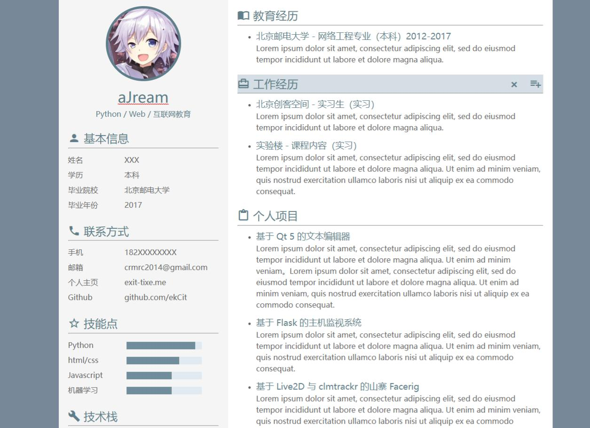
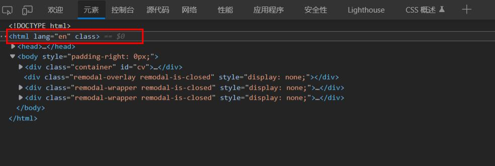
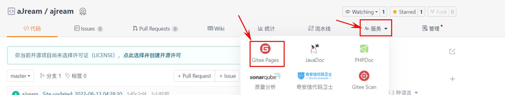
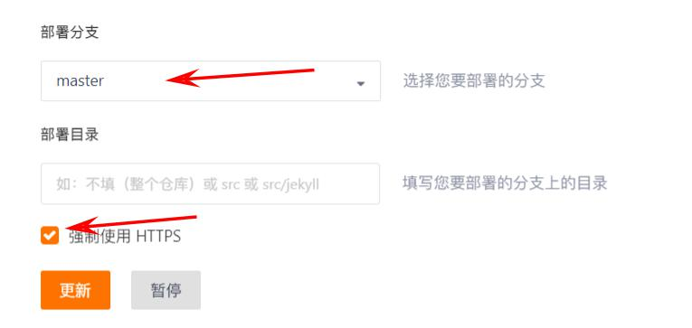
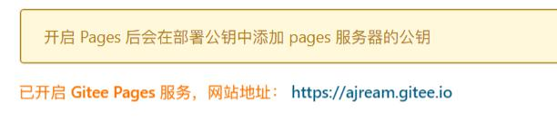

# 网页版个人简历部署（上）

> 写在前面的话：
> 
> 需要明白的两个核心问题：
> 1. 简历制作：
> 想要做一个网页版的个人简历，要求不高的话，其实只需要一个静态的html文件即可（或者再加个css样式文件）
> 2. 简历部署：
> 采用github或者gitee提供的pages服务，可以很快部署完成，并能够访问（本文讲解使用gitee pages） 
> 
> 本篇文章主要解决这两个问题。

> 
> 
> 另外，除了进行简历制作和部署外，我还添加了密码检验这个功能，即需要正确输入密码后才能查看简历。
> 这个放到下一篇文章讲。


## 简历制作

对于想要快速制作一份简历的同学来说，如果没有特殊或者很高的要求，可以去网上找一份模板，改改就成自己的了

可以参考[这位博主的文章](https://zhuanlan.zhihu.com/p/22250197)，可以前往下面的链接进行下载简历：

> 简历链接：http://labfile.oss.aliyuncs.com/courses/624/cv-template.zip

下载后进入文件夹内，用浏览器打开 `index.html` 文件，即可查看并编辑简历内容



说明：
1. 点击图片可以更换图片（比如头像）
2. 选中文字后使用快捷键 <kbd>Ctrl+b</kbd> 可以对文字进行加粗处理
3. 微信二维码模块不想要可以删除掉（点击X号，其它模块也一样）


**【下面是重点】**

编辑完成后，需要保存，如何保存呢？

1. 首先 <kbd>F12</kbd> 打开浏览器（我这里用的是edge，Chrome、火狐均可以）开发者工具

右键 `html` 这一标签，选择“编辑为HTML”，然后就能<kbd>ctrl+a</kbd>全选和复制了
2. 复制全部后，用记事本或其它文本编辑工具重新打开 `index.html` 文件，删除全部内容，然后粘贴刚复制的东西，再<kbd>ctrl+s</kbd>保存就行了
3. 重新用浏览器打开 `index.html` 就能看到修改完成后的简历了

> 到达这里就算是制作好一份简历了，如果想导出pdf可以选择浏览器的“打印”，然后就能导出了
> 制作完成的简历如果想让它不再能够编辑的话，可以把 index.html 里引用的js文件都注释掉。


## 简历部署

接下来就可以将简历部署到gitee pages(或者gitee pages)了

首先你需要懂一些git相关的基本知识，另外本地安装了git工具，至少会使用如下几条命令：

```bash
git init   # 将一个普通文件夹初始化为一个git仓库
git add .  # 添加到本地暂存库
git commit -m "提交信息xxxxxx"  # 提交文件到仓库
git push -u gitee master  # 推送到远程仓库的master分支

git remote add [远程仓库名，自定义，如origin] [仓库链接(SSH版)]
git remote -v  # 查看已经关联的远程仓库

```

接下来就可以进行部署了

1. 首先登录gitee创建一个仓库
2. 初始化本地仓库（使用 `git init` 命令），关联远程仓库 `git remote add [仓库名] [仓库链接]`
3. 然后一顿操作 `git add .`, `git commit -m "xxx"`, `git push -u xxx master` 就可以提交到远程仓库了

然后开启gitee pages（第一次使用这个功能可能需要向客服申请，需要大概一天时间，GitHub的就不用）


配置如下即可


开启后上面会给出一个链接，点击即可访问自己的简历了。



> 到这里就完成一份简单的网页版个人简历部署了😀


